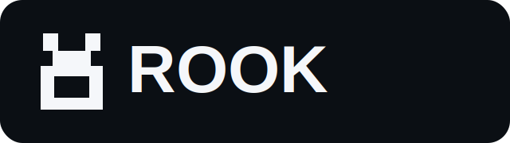
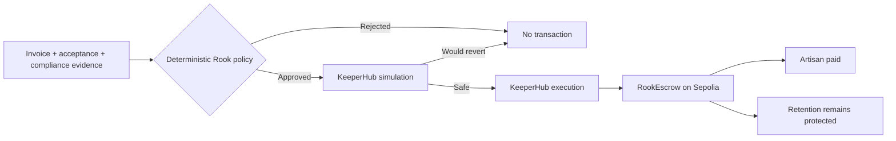

<p align="center"></p>

# Rook — evidence-gated construction payments

> **Clients fund once. Artisans get paid when the evidence is there.**

Rook turns a construction milestone into a deterministic payment mandate. Mandatory evidence and compliance rules run before any chain call. Approved mandates are simulated and executed through KeeperHub; rejected mandates stop before KeeperHub. A fixed-recipient escrow keeps contractual retention protected.

## Why it exists

Construction payments are a trust problem: clients fear paying too early, while artisans wait for cash after completing work. Rook makes the release rule explicit, auditable and executable.



## Hackathon fit

Rook uses KeeperHub as the actual execution and reliability layer:

- Direct Execution contract call;
- identical request payload from dry-run to broadcast;
- organization API-key authentication;
- deterministic idempotency key;
- status polling using KeeperHub's interval hint;
- transaction hash and explorer link treated as authoritative proof.

## Security properties

- an AI agent cannot override policy;
- signed acceptance and invoice evidence are mandatory;
- an open dispute blocks release;
- the same mandate creates the same decision and idempotency key;
- duplicate decisions are rejected onchain;
- the recipient is immutable in the escrow;
- the client cannot withdraw the balance before expiry;
- only the KeeperHub executor role can release funds;
- no stub result is represented as a real transaction.

See [`docs/THREAT_MODEL.md`](docs/THREAT_MODEL.md) and [`SECURITY.md`](SECURITY.md).

## Repository contents

```text
apps/api/                 FastAPI policy and KeeperHub adapter
apps/demo/                judge-facing Streamlit application
contracts/                RookEscrow, MockUSDC, tests and deployment
examples/                 approved and rejected API mandates
scripts/                  setup, smoke, preflight, OpenAPI and submission tools
docs/                     architecture, threat model, pitch and demo runbook
assets/                    reusable Rook branding
```

## Judge quickstart

See [`docs/JUDGE_QUICKSTART.md`](docs/JUDGE_QUICKSTART.md) for the shortest review path.

## Local preview — no wallet required

```bash
cp .env.example .env
./scripts/bootstrap.sh
make quality
make readiness
```

Then run, in two terminals:

```bash
make run-api
make run-demo
```

`KEEPERHUB_MODE=stub` is an explicit safe preview. It returns the exact proposed KeeperHub call but submits no transaction.

API examples:

```bash
curl -s http://localhost:8000/v1/releases/evaluate \
  -H 'Content-Type: application/json' \
  --data @examples/approved-release.json | python -m json.tool
```

Interactive API documentation is available at `http://localhost:8000/docs`.

## Live KeeperHub run

1. Read [`docs/KEEPERHUB_SETUP.md`](docs/KEEPERHUB_SETUP.md).
2. Fill the account-specific values in `.env`.
3. Run:

```bash
make deploy
make live-preflight
make run-api
make run-demo
```

The safe write path follows KeeperHub's documented sequence: enabled testnet check, strict boolean dry-run, unchanged broadcast payload, unique idempotency key, status polling, and authoritative transaction proof.

## Automated quality gates

```bash
make quality
```

This runs secret/large-file preflight, Ruff, mypy, Python tests with coverage, Solidity tests, an end-to-end stub smoke scenario and OpenAPI export. GitHub Actions repeats these checks and runs Gitleaks.

## Submission kit

- [`docs/PITCH.md`](docs/PITCH.md)
- [`docs/VIDEO_SCRIPT.md`](docs/VIDEO_SCRIPT.md)
- [`docs/DEMO_RUNBOOK.md`](docs/DEMO_RUNBOOK.md)
- [`docs/SUBMISSION_CHECKLIST.md`](docs/SUBMISSION_CHECKLIST.md)
- [`docs/SUBMISSION_TEMPLATE.md`](docs/SUBMISSION_TEMPLATE.md)

After setting final URLs:

```bash
REPOSITORY_URL=... DEMO_VIDEO_URL=... TRANSACTION_URL=... make submission
```

## Product continuation

Rook is designed to become **iArtisanat Secure Payments**: a provider-neutral module sold as a subscription add-on and protected-milestone service, with regulated payment/custody partners for production flows.

## Legal scope

Rook is a technical testnet prototype, not a regulated escrow, payment or custody service. Production deployment requires jurisdiction-specific legal review, identity controls, dispute procedures and a licensed partner.

MIT licensed.
